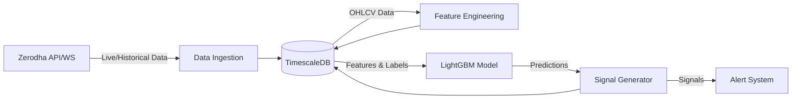

# Automated Intraday Trading Signal Generation System

## 🎯 Overview

This project is a production-grade, local trading signal generation system designed for intraday trading of Indian indices (NIFTY 50, BANK NIFTY, etc.) on a 15-minute timeframe. Built with a focus on clean architecture, modularity, and memory efficiency, it leverages the Zerodha KiteConnect API for data ingestion and LightGBM for machine learning-based signal generation.

**Important Notice:** This system generates trading signals but does not execute trades or manage portfolios automatically. It serves as a quantitative analysis tool to support data-driven decision-making.

---

## 🏗️ Architecture Overview

The system employs a database-centric architecture where TimescaleDB acts as the single source of truth for all time-series data, features, and generated signals. 

### Core Components

- **Broker Integration**: REST client and WebSocket client for Zerodha KiteConnect, featuring connection management and automatic backfilling.
- **Data Pipeline**: Distinct pipelines for historical data processing and real-time streaming, including aggregation (1m to 5m, 15m, 60m).
- **Feature Engineering**: Calculation of 20+ technical indicators across multiple timeframes using TA-Lib and Pandas.
- **Labeling Strategy**: Implementation of the Triple Barrier Method (take-profit, stop-loss, and time barriers) to classify historical data for model training.
- **Machine Learning**: LightGBM-based model training and inference with walk-forward validation.
- **State Management**: Resilient state tracking, health monitoring, and circuit-breaker error handling.

---

## 🚀 Technology Stack

- **Language**: Python 3.11+
- **Database**: PostgreSQL with TimescaleDB Extension (Optimized for time-series)
- **Machine Learning**: LightGBM, Scikit-learn
- **Data Processing**: Pandas, NumPy, TA-Lib
- **API & Networking**: FastAPI, Flask (for OAuth callback), HTTPX, WebSockets
- **Monitoring**: Prometheus, Grafana
- **Infrastructure**: Docker, Docker Compose

---

## 🧠 Machine Learning Model Documentation

### Model Specifications
- **Model Type**: Gradient Boosting Decision Tree (LightGBM `LGBMClassifier`)
- **Version**: 1.0 (Walk-forward trained)
- **Training Approach**: Walk-forward validation over rolling historical windows to adapt to changing market regimes.

### Features & Output
- **Input Features**: Multi-timeframe technical indicators including RSI, MACD, Bollinger Bands, ATR, ADX, and volume profiles.
- **Output Predictions**: Probabilistic multi-class classification for `BUY` (1), `SELL` (-1), and `HOLD` (0) signals.
- **Evaluation Metrics**: Sharpe ratio, win rate, maximum drawdown, and precision/recall per class.

### Methodology & Limitations
- **Labeling**: Uses the Triple Barrier Method. A dynamic epsilon is applied to determine the minimum required return, adjusting for intraday volatility and session timings.
- **Limitations**: The model is highly dependent on the quality of broker data and is sensitive to extreme macro-economic events (black swan events) that deviate significantly from historical patterns.

---

## 🔒 Security Considerations

- **Secrets Management**: All API keys, secrets, and administrative tokens are managed strictly via environment variables (`.env`).
- **Connection Security**: The system enforces SSL verification for all external API communications to prevent man-in-the-middle (MITM) attacks.
- **Data Integrity**: Destructive operations (like database truncation) are gated by administrative tokens and environment flags that default to safe states (`TRUNCATE_ALL_DATA=false`).

---

## 📊 Monitoring and Observability

The application includes a comprehensive observability stack powered by Prometheus and Grafana.

- **System Metrics**: CPU, memory usage, and database connection pool statistics.
- **Application Metrics**: API request latencies, rate limiting status, and WebSocket connection health.
- **Trading Metrics**: Signal generation latency, prediction confidence distributions, and data processing throughput.

---

## 🚢 Deployment

The system is containerized for consistent deployment across environments.

### Prerequisites
- Docker and Docker Compose
- Minimum 8GB RAM recommended for the TimescaleDB instance and ML processing.

### Running the System
1. Copy the environment template: `cp .env.example .env` and fill in your credentials.
2. Build the images: `make build`
3. Start the production environment: `make up`

### Environment Modes
- **Historical Mode**: Used for initial data backfilling, feature calculation, and model training.
- **Live Mode**: Subscribes to WebSockets for real-time data ingestion and periodic (15-minute) signal generation.

---

## 🗺️ Future Roadmap

- **Execution Integration**: Add optional modules for automated order placement and portfolio risk management.
- **Alternative Data**: Incorporate options chain data and sentiment analysis for enhanced feature engineering.
- **Advanced Alerting**: Implement integrations with Telegram, Slack, and PagerDuty for real-time signal notifications.

---

## 🤖 Project Development Approach

- **Solution Architecture and System Design**: Author
- **Implementation**: AI Agents under architectural guidance
- **Architecture decisions, requirements, and validation**: Author
- **Code generation and iterative development**: AI-assisted

This project demonstrates the successful orchestration of AI-assisted engineering to produce a robust, scalable, and production-ready financial system.

---

## 📄 License
This project is licensed under the MIT License - see the [LICENSE](LICENSE) file for details.

## ⚠️ Disclaimer
This software is for educational and research purposes only. It is not intended to provide investment advice. Trading in financial markets involves substantial risk of loss. Past performance does not guarantee future results. Use at your own risk.
